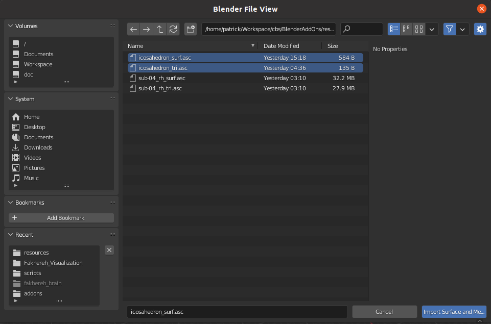
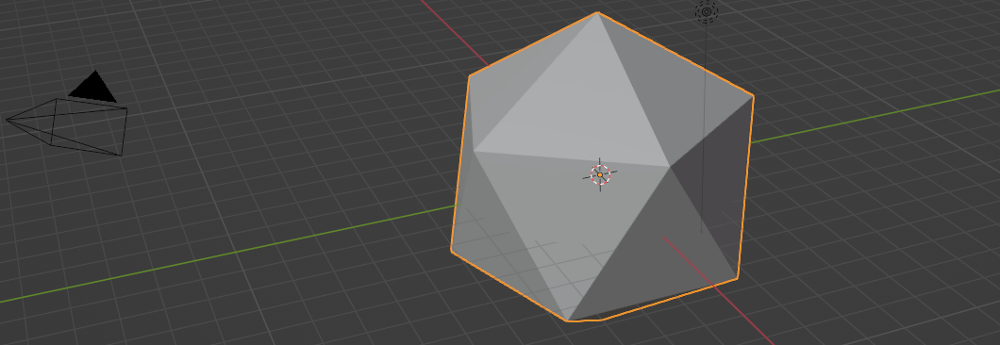
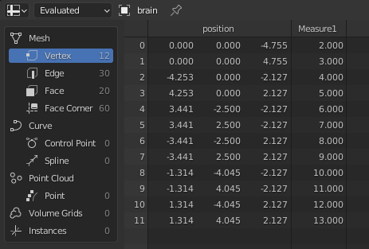
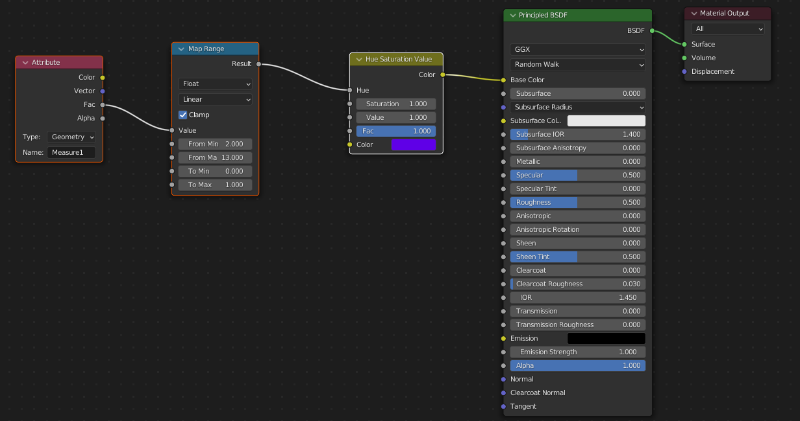
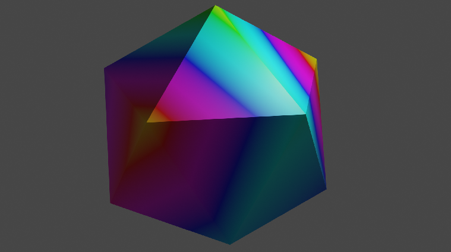

# Blender Add-Ons for scientific visualizations

Small scripts and addons that allow for visualizing scientific data with a real renderer. Blender >= 3.1 should be used. 

## Import Surfaces with Measures

Copy, paste and execute the contents of `scripts/addons/import_surface_with_measures.py` into the Scripting window of 
Blender. You get a entry in **File | Import | Surface and Measures**.
Prepare a file `xxx_surf.asc` as exemplified in `resources/icosahedron_surf.asc` that contains in each line `id`
(is ignored, and assumed to from 1..n), `x`, `y`, `z`, and measures `m1`, ..., `mn` (as many as you have).
Prepare a file `xxx_tri.asc` as exemplified in `resources/icosahedron_tri.asc` that contains in each line the
vertex ids for a polygon (e.g. a triangle).

Use **File | Import | Surface and Measures** and select both files and click OK.

Your surface will be imported and each vertex will have you `n` measures attached as a float attribute.

These attributes can be seen in the _Spreadsheet_ window of Blender when selecting your object.

You can use these attributes in the Material Node editor to colorize your surface creating a visualization of your experiment.
Below is an example that rescales all attribute values and uses it as Hue input to change color.
However, you are free to use them however you want.

The rendered output for the example looks like this.

